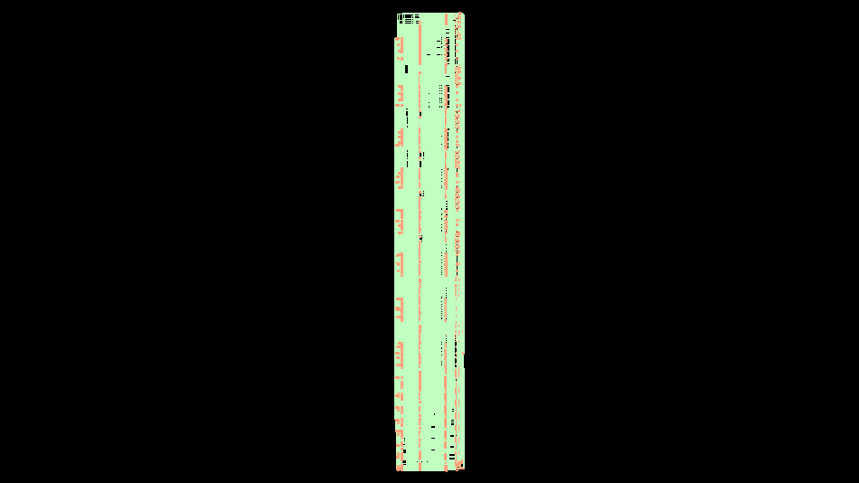

# Designing a 128 Bytes Dual Port RAM Using Cadence Genus and Innovus

## Project Overview

The objective was to design a 128 Bytes Dual Port RAM, a fundamental component in many digital systems. This design features dual ports, allowing simultaneous read and write operations, enhancing performance in various applications.

## Steps Involved

### 🖥️ Verilog Design
- Developed a Verilog module for the 128 Bytes Dual Port RAM, focusing on optimizing memory operations for efficiency and dual port functionality.

### 🔧 Synthesis with Genus
- Used Cadence Genus to synthesize the Verilog code into a gate-level netlist.
- Applied constraints and performed optimizations to balance performance and area.

### 🏗️ Place-and-Route with Innovus
- Imported the synthesized netlist into Cadence Innovus for physical design.
- Conducted floorplanning, placement, clock tree synthesis, and routing.
- Ensured the design adhered to all timing, area, and power specifications.

## Highlights
- Successfully addressed and overcame design constraints and optimization challenges.
- Produced detailed reports covering area, gate count, power consumption, and timing analysis.
- Achieved a functional and verified physical layout, ready for fabrication.

## Visuals
Here are some screenshots from the Innovus tool, showcasing the schematic, layout and routing of the 128 Bytes Dual Port RAM.

This project has been an invaluable learning experience, reinforcing my expertise in digital design and EDA tools. I look forward to exploring more complex design challenges in the future! 🌟

Feel free to reach out if you have any questions or would like to discuss this project in more detail.

## Tags
hashtag#EDA hashtag#Verilog hashtag#Cadence hashtag#Genus hashtag#Innovus hashtag#DigitalDesign hashtag#VLSI hashtag#Semiconductors
